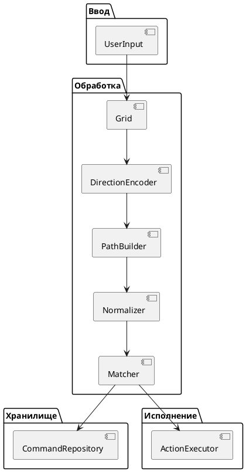

# Текст для отчета по технологической практике

## Реферат

ГРАФОВЫЕ ПАТТЕРНЫ, СИМВОЛЬНЫЕ КОМАНДЫ, ИНТЕРАКТИВНЫЕ ПРИЛОЖЕНИЯ, ГРАФОВЫЕ СЕТКИ, ПРОГРАММНАЯ БИБЛИОТЕКА, ОБРАБОТКА ПОЛЬЗОВАТЕЛЬСКОГО ВВОДА, МОДУЛЬНОЕ ТЕСТИРОВАНИЕ.

Объект практики — программные средства распознавания и исполнения пользовательских символьных команд в интерактивных приложениях.

Предмет практики — методы и алгоритмы представления графовых сеток, преобразования координатного ввода в дискретный маршрут, сопоставления паттернов и программной организации исполнительного контура библиотеки.

Целью практики является разработка программной библиотеки для распознавания и исполнения символьных команд, вводимых пользователем на графовых сетках произвольной структуры, обеспечивающей преобразование координат ввода в путь по графовой модели, сопоставление полученного паттерна с зарегистрированной командой и вызов соответствующей логики.

Результатом работы является реализованное библиотечное ядро GridCasting, включающее графовую модель сетки, механизм локализации пользовательского ввода, исполнительный контур команд, расширяемую подсистему трансформации пути, а также набор автоматизированных тестов, подтверждающих работоспособность основных сценариев обработки.

## Введение

Современные интерактивные системы, включая видеоигры и мультимедийные приложения, все чаще используют такие формы взаимодействия, которые позволяют пользователю вводить команды не только через кнопки и меню, но и через более естественные пространственные действия. Одним из таких направлений является работа с графическими паттернами и символьными командами, задаваемыми на плоскости в виде последовательности переходов между опорными точками. Подобные механики представляют практический интерес для игровых и интерактивных приложений, однако их реализация нередко оказывается связанной с ограничениями конкретной геометрии сетки или с жесткой привязкой к заранее заданному формату ввода.

В рамках данного проекта рассматривается задача распознавания не непрерывного жеста в классическом смысле, а дискретного паттерна, формируемого пользователем на графовой сетке. Такой подход смещает акцент с анализа формы произвольной траектории на интерпретацию последовательности переходов в структуре, заданной графом. Вследствие этого особое значение приобретают абстрактное представление сетки, устойчивость к вариативности пользовательского ввода, а также возможность сопоставления полученного маршрута с набором заранее зарегистрированных команд.

Целью разработки является создание инструментальной библиотеки, способной преобразовывать координатный ввод пользователя в путь по графовой модели, выполнять подготовку этого пути к сопоставлению и инициировать вызов соответствующей команды. Важным требованием при этом выступает независимость от конкретного типа сетки. Библиотека должна оставаться применимой не только к одной фиксированной геометрии, но и к различным структурам, если они могут быть представлены в виде графа с вершинами и связями между ними.

Особенность настоящего отчета состоит в том, что он описывает не проектное предположение, а фактически выполненную реализацию. При этом сам документ должен восприниматься как самостоятельный текст, не требующий обращения к проектной части. Поэтому далее кратко повторяются исходные положения задачи, затем рассматриваются изменения, возникшие по мере перехода от проектной модели к коду, после чего последовательно раскрываются использованные средства разработки, реализованные механизмы, программная структура библиотеки, результаты первичной проверки и направления дальнейшего развития.

## 1. Технологический раздел

### 1.1. Проектные изменения

Переход от проектной модели к программной реализации привел не только к подтверждению ранее выбранных архитектурных решений, но и к их уточнению. На этапе проектной практики предполагалось, что библиотека будет состоять из нескольких четко разделенных стадий: интерпретации координат, построения пути, нормализации паттерна, сопоставления с командой и исполнения результата. В текущей реализации эта схема в целом сохранилась, однако конкретное распределение ответственности между компонентами оказалось иным [1.6; 1.7; 1.8].

Ниже описываются не абстрактные проектные предположения, а изменения, подтверждаемые текущим состоянием репозитория, листингами кода, тестовым проектом `GridCastingTests` и материалами приложений, включающими структуру каталогов, идентификатор коммита и фрагмент вывода `dotnet test`.

Первое существенное изменение связано с завершением публичного контура исполнения. В раннем состоянии проекта метод `GridCasting.Execute()` выполнял лишь начальный шаг обработки, передавая координаты в резолвер и не доводя конвейер до исполнения команды. В актуальной реализации это ограничение снято. Класс `GridCasting` теперь создает и хранит экземпляр `PathExecutor`, а публичный метод `Execute(FVector2[] positions)` сначала формирует путь через `GridResolver`, после чего при успешном результате передает его в исполнительный слой. Тем самым библиотека получила завершенную внешнюю точку входа, соответствующую исходному проектному замыслу [1.3; 1.4; 1.5].

Второе изменение относится к механизму трансформации паттернов. В проектной документации нормализация рассматривалась как отдельная логическая стадия, близкая по роли к специальному модулю Normalizer. В актуальной реализации эта функция оформлена более гибко: интерфейс `IPathTransform` теперь содержит признак `IsRequired`, а класс `PathExecutor` использует набор трансформаций двояко. При регистрации команды обязательные трансформации применяются к паттерну сразу, а при исполнении исходный путь последовательно расширяется преобразованными вариантами. Если трансформация не обязательна, в пуле кандидатов сохраняется и исходный путь. Такой подход делает архитектуру менее жесткой и лучше приспособленной к сочетанию строгих и альтернативных схем сопоставления [1.1; 1.2; 1.9].

Третье изменение связано с расширением ответственности `PathExecutor`. На проектном этапе сопоставление и исполнение мыслились как отдельная стадия после нормализации. В текущем коде исполнительный слой сам хранит ссылку на `GridGraph` и набор трансформов, то есть выступает не только как хранилище команд, но и как управляющий центр для этапа сопоставления. Это изменение можно считать обоснованным: поскольку именно `PathExecutor` принимает окончательное решение о том, какая команда должна быть вызвана, логично, что он же управляет применением трансформаций перед поиском совпадения [1.7; 1.8; 1.10].

Четвертое важное уточнение касается графовой модели. Ранее `GridGraph` рассматривался главным образом как абстракция для работы резолвера. В новой реализации появился метод `GridResolver.CreateGridGraph(Grid grid)`, выполняющий обратное преобразование из прикладной сеточной структуры `Grid` в графовую модель. Этот метод не только строит граф, но и валидирует его, отслеживая неоднозначные совпадения и незамкнутые связи. Соответственно, библиотека получила дополнительный технологический уровень: она теперь способна не просто использовать заранее созданный граф, но и восстанавливать его из сеточной структуры при соблюдении условий согласованности [1.6; 1.8].

Наконец, были уточнены правила обхода графа и работы с ребрами. В классе `GridGraphEdge` концы ребра сделали изменяемыми внутри сборки, что позволило поэтапно достраивать граф при преобразовании из `Grid`. Одновременно в `GridResolver` была пересмотрена логика прохождения ребер: длина перехода теперь трактуется со знаком в зависимости от того, из какого конца ребра выполняется движение. Это исправление имеет не только техническое, но и содержательное значение, поскольку делает обход двусторонней графовой структуры корректным и согласованным с геометрией узлов [1.6; 1.7].

Таким образом, изменения относительно проектной практики носят не декларативный, а конструктивный характер. Они не отменяют исходную архитектурную идею, а переводят ее в более реализуемую и более гибкую форму. При этом важно подчеркнуть, что ряд проектных положений уже достигнут практически, тогда как некоторые - прежде всего углубленная нормализация паттернов и развитый тестовый контур - пока продолжают оставаться задачами следующего этапа [1.1; 1.2; 1.8].

### Сопоставление проектной и актуальной архитектурных схем

Для технологического отчета важно показать не только перечень изменений, но и их архитектурное выражение. Поэтому целесообразно сопоставить исходную структурную схему из проектной части и обновленную схему, соответствующую фактической реализации библиотеки. Такое сравнение позволяет увидеть, какие идеи сохранились, а какие были конкретизированы или перераспределены между новыми программными компонентами [1.7; 1.8; 1.10].

Ниже приведена диаграмма, перенесенная из `project.md` без смысловых изменений. Она отражает то представление о системе, которое использовалось на проектном этапе.



Актуальная реализация может быть представлена следующей схемой, в которой показаны уже не проектные роли, а конкретные классы и интерфейсы текущего кода.

```plantuml
---
title: Актуальная структурная схема реализации GridCasting
---
@startuml "Актуальная структурная схема реализации GridCasting"

package "Внешний вызов" {
    [UserInput]
    [GridCasting]
}

package "Преобразование ввода" {
    [GridResolver]
    [PointBVH2D]
    [GridGraph]
    [Grid]
}

package "Сопоставление паттернов" {
    [IPathTransform]
    [PathExecutor]
    [Trie<int, ICommand>]
}

package "Исполнение" {
    [ICommand]
    [CommandContext]
    [IEnvironmentResolver]
}

UserInput --> GridCasting
GridCasting --> GridResolver
GridResolver --> PointBVH2D
GridResolver --> GridGraph
Grid --> GridResolver
GridCasting --> PathExecutor
PathExecutor --> IPathTransform
PathExecutor --> Trie<int, ICommand>
Trie<int, ICommand> --> ICommand
PathExecutor --> CommandContext
CommandContext --> IEnvironmentResolver

@enduml
```

Сопоставление этих схем показывает, что проектная цепочка `DirectionEncoder -> PathBuilder -> Normalizer -> Matcher` не исчезла, а была уплотнена и перераспределена. В фактической реализации преобразование координат в маршрут сосредоточено в `GridResolver`, тогда как функции нормализации и сопоставления паттернов перенесены в связку `IPathTransform` и `PathExecutor`. Таким образом, новая архитектура сохраняет логику исходного замысла, но выражает ее через меньшее число более емких компонентов [1.1; 1.2; 1.6].

Существенно изменился и способ представления хранилища и исполнения команд. Вместо абстрактных блоков `CommandRepository` и `ActionExecutor` в коде используются конкретные средства: `Trie<int, ICommand>` как структура хранения паттернов, `PathExecutor` как управляющий центр сопоставления и вызов `ICommand.Execute(...)` через `CommandContext` как форма исполнения результата. За счет этого новая диаграмма отражает не просто теоретический сценарий работы, а реальную внутреннюю организацию библиотеки [1.8; 1.10].

Отдельно следует отметить появление элементов, отсутствовавших в проектной диаграмме в явном виде. К ним относятся фасад `GridCasting`, пространственный индекс `PointBVH2D`, а также обратное преобразование `Grid -> GridGraph`, ставшее возможным благодаря `GridResolver.CreateGridGraph`. Эти компоненты показывают, что за время технологической практики библиотека приобрела более завершенный программный контур и стала ближе к практической интеграции в интерактивные приложения [1.3; 1.4; 1.5; 1.9].

### 1.2. Обоснование выбора средств разработки проекта в целом

Выбор технологической платформы определялся особенностями разрабатываемой библиотеки. Проект связан с обработкой структурированных данных, геометрическими вычислениями, обходом графовых моделей и построением расширяемого программного интерфейса. Для таких задач требовалась среда, которая одновременно поддерживает строгую типизацию, обеспечивает достаточно высокую производительность и позволяет без избыточных затрат встраивать результат в другие приложения. Поэтому в качестве основного языка реализации был выбран C#, а в качестве платформы - .NET 8 [2.1; 2.2].

Использование C# оправдано прежде всего архитектурно. Проект состоит из нескольких взаимосвязанных слоев: модели графовой сетки, подсистемы разрешения пользовательского ввода, исполнительного слоя команд и набора утилит для пространственного поиска и хранения паттернов. В такой системе строгая типизация является не только средством контроля ошибок, но и формой проектирования интерфейсов. Это особенно заметно в конструкциях `ICommand`, `IEnvironmentResolver` и `IPathTransform`, которые задают точки расширения библиотеки. Поддержка nullable-типов также повышает надежность кода за счет более явного контроля ссылочных состояний [2.2; 2.3].

Платформа .NET 8 была выбрана как поддерживаемая LTS-среда исполнения, сочетающая кроссплатформенность и производительность, достаточную для интерактивной обработки пользовательского ввода. Важно, что библиотека не привязана к одному конкретному движку или типу приложения. Благодаря этому .NET позволяет сохранить изначально задуманную универсальность решения. Дополнительным преимуществом является стандартная система сборки SDK-style и MSBuild, делающая проект удобным для дальнейшего сопровождения, интеграции и публикации [2.1; 2.4; 2.5].

Отдельно следует отметить подключение внешнего математического модуля `IgdrasilMath`. Для рассматриваемой библиотеки операции над двумерными векторами, расстояниями и ограничивающими прямоугольниками являются базовыми. Использование уже существующего математического компонента позволило не дублировать низкоуровневую геометрическую инфраструктуру и сосредоточиться на ключевой задаче проекта - распознавании графовых паттернов и исполнении связанных с ними команд.

### 1.3. Обоснование выбора инструментальных средств для отдельных элементов

Основой библиотеки выступает графовая модель сетки, представленная классами `GridGraph`, `GridGraphNode` и `GridGraphEdge`. Выбор именно графового представления является принципиальным, поскольку позволяет отделить топологию связей между узлами от конкретного типа замощения. В рамках поставленной задачи это важнее, чем удобство работы с какой-либо одной конкретной сеткой, потому что библиотека должна оставаться применимой в различных интерактивных средах. Дополнение ребра параметрами угла и длины позволяет объединить топологическую и геометрическую сторону модели в одной структуре [2.8; 2.9; 2.10; 2.11].

Роль центрального вычислительного инструмента выполняет `GridResolver`. Он объединяет в себе несколько функций, которые в проектной модели могли бы быть распределены между отдельными модулями: проверку графа, генерацию сеточного представления, локализацию координат, построение маршрута и восстановление графа из `Grid`. Такое объединение оправдано практикой реализации: все перечисленные задачи используют одну и ту же графовую основу и один набор геометрических допущений, поэтому их сосредоточение в общем компоненте упрощает взаимодействие модулей и делает логику преобразований более согласованной [2.8; 2.9].

Для пространственного поиска выбран `PointBVH2D`. Его использование объясняется тем, что сопоставление пользовательской координаты с вершиной графа не должно строиться на полном переборе всех точек. По мере роста графа это привело бы к избыточным затратам. BVH-индекс, напротив, позволяет ограничить проверку лишь релевантными областями пространства и тем самым ускорить локализацию ввода. В контексте библиотеки этот выбор особенно уместен, поскольку поиск ближайшей точки является частью более общего контура распознавания паттерна [2.8; 2.10; 2.11].

Для хранения командных паттернов используется префиксное дерево `Trie<int, ICommand>`. Такой выбор соответствует самой форме данных: путь в библиотеке представляет собой последовательность целых чисел, включающую стартовый узел и набор локальных переходов. Префиксное дерево естественно поддерживает хранение и сопоставление таких последовательностей, а также оставляет пространство для дальнейшего расширения, связанного с семействами паттернов и альтернативными вариантами распознавания [2.8; 2.9; 2.10].

Инструментальным средством для управления преобразованиями пути служит интерфейс `IPathTransform`. В актуальной версии проекта он не просто задает операции преобразования и обратного преобразования, но и позволяет делить трансформации на обязательные и факультативные. Это делает механизм сопоставления более гибким и переводит нормализацию из жестко фиксированного этапа в управляемый набор правил, который может расширяться без изменения ядра библиотеки [2.2; 2.3].

Принципиальная роль данного интерфейса видна уже на уровне его определения, где явно зафиксировано различие между обязательными и необязательными преобразованиями.

```csharp
public interface IPathTransform
{
    public bool IsRequired { get; }
    public Path Transform(GridGraph graph, Path path);
    public Path Reverse(GridGraph graph, Path path);
}
```

Исполнительный контур строится вокруг `PathExecutor`, `CommandContext`, `ICommand`, `IEnvironmentResolver` и `ListenableDictionary`. Такой набор выбран потому, что он отделяет задачу распознавания команды от задачи управления состоянием внешней среды. Команда в данной архитектуре рассматривается не как жестко прошитая функция, а как объект, получающий контекст и работающий с состоянием через согласованный интерфейс. Это особенно важно для будущего использования библиотеки в игровых и интерактивных системах, где сам факт распознавания паттерна еще не является конечной целью [2.2; 2.3; 2.11].

### 1.4. Описание реализации практических процессов библиотеки

Реализация практических процессов в GridCasting может быть представлена как последовательность технологических стадий, проходящих от исходной сеточной модели и пользовательского ввода к исполнению команды. Первой такой стадией является построение или использование графовой структуры. Если граф задан напрямую, библиотека может немедленно использовать его для локализации и обхода. Если же исходная структура представлена в виде `Grid`, то `GridResolver.CreateGridGraph` позволяет преобразовать ее в графовую модель, одновременно проверяя целостность связей и отсутствие неоднозначностей.

После подготовки графа выполняется инициализация `GridResolver`, в ходе которой граф обходится, для каждой вершины вычисляется координатное представление и формируется пространственный индекс `PointBVH2D`. На этом этапе библиотека фактически строит внутреннюю карту опорных точек, которые в дальнейшем будут сопоставляться с пользовательским вводом. Эта стадия важна тем, что переносит существенную часть вычислительной работы из онлайн-обработки в фазу подготовки.

Следующий процесс начинается в публичном методе `GridCasting.Execute(FVector2[] positions)`. Полученный массив координат передается в `GridResolver.GetPath`, который сначала определяет стартовую точку, а затем последовательно проверяет возможность перехода по каждому следующему ребру. Если ввод согласован со структурой графа, формируется объект `Path`; если нет, обработка прекращается. Таким образом, непрерывный координатный ввод преобразуется в дискретный маршрут по графу.

Текущее состояние внешнего контура хорошо видно в реализации фасада `GridCasting`, где распознавание и исполнение уже объединены в одном публичном сценарии.

```csharp
public class GridCasting(
    GridGraph graph,
    float sensitivity,
    params IEnumerable<IPathTransform> transforms
) {
    private readonly GridResolver _resolver = new(graph, sensitivity);

    public PathExecutor Executor { get; } = new(graph, transforms);

    public void Execute(FVector2[] positions)
    {
        var path = _resolver.GetPath(positions);
        if (path.HasValue) Executor.Execute(path.Value);
    }
}
```

После построения пути управление передается в `PathExecutor`. На этой стадии проявляется одно из ключевых обновлений текущей реализации. Исполнительный слой не ограничивается простым поиском точного совпадения: он последовательно применяет к пути заданные трансформации. Для обязательных трансформаций дальнейшая обработка ведется только через преобразованный вариант, а для необязательных сохраняются и исходные, и преобразованные пути. Полученное множество кандидатных маршрутов затем используется для поиска команды в trie-структуре.

Если совпадение найдено, создается `CommandContext`, включающий исходный путь, состояние окружения и стек исполнения. После этого вызывается метод `Execute` соответствующей команды. Следовательно, в актуальной версии проекта реализован уже не только внутренний алгоритм распознавания, но и полноценный внешний цикл исполнения: от координатного ввода до запуска прикладной логики.

#### Минимальный пример использования библиотеки как внешнего API

Для читателя важно видеть не только внутреннюю структуру классов, но и то, как библиотека применяется извне. Наиболее показателен пример, в котором задействован полный пайплайн: создается граф, подключается `IEnvironmentResolver`, регистрируется команда, затем в библиотеку передается координатный ввод, а успешное распознавание приводит к изменению внешнего состояния через окружение исполнения.

```csharp
public sealed class CombatStateResolver : IEnvironmentResolver
{
    private readonly Dictionary<string, object> _state = new()
    {
        ["spellReady"] = false
    };

    public IEnumerable<KeyValuePair<string, object>> OnLoad() => _state;
    public void OnUnload() { }
    public object? OnReset(string key) => key == "spellReady" ? false : null;
    public void OnChange(string key, object value) => _state[key] = value;
    public event Action<string, object> OnUpdate = delegate { };
}

public sealed class PrepareSpellCommand : ICommand
{
    public void Execute(CommandContext context)
    {
        context.Environment["spellReady"] = true;
    }
}

var graph = new GridGraph();
var node = new GridGraphNode();
for (var i = 0; i < 6; i++)
    node.Edges.Add(new GridGraphEdge(node, node, MathF.PI * i / 3, 1));
graph.Nodes.Add(node);

var resolver = new CombatStateResolver();
var casting = new GridCasting.GridCasting(graph, 0.1f);
casting.Executor.AddEnvironmentResolver(resolver);
casting.Executor.AddCommand(
    new PrepareSpellCommand(),
    new Path(0, 0, 2, 1)
);

casting.Execute([
    new FVector2(0f, 0f),
    new FVector2(1f, 0f),
    new FVector2(0.5f, 0.866f),
    new FVector2(1f, 1.732f)
]);

// Ожидаемый эффект:
// resolver содержит состояние spellReady == true
```

В приведенном сценарии библиотека используется как внешний механизм игровой логики полного цикла. Координаты пользователя сначала преобразуются в маршрут через `GridResolver`, затем передаются в `PathExecutor`, сопоставляются с зарегистрированным паттерном и, при успехе, инициируют выполнение команды. Команда, в свою очередь, не изменяет глобальное состояние напрямую, а работает через `CommandContext.Environment`, связанный с `IEnvironmentResolver`. Это наглядно показывает, что библиотека уже поддерживает не только распознавание паттерна, но и контролируемое воздействие на внешнюю систему.

### 1.5. Описание реализованных механизмов

Первым ключевым механизмом является представление сетки как ориентированно-геометрического графа. Хотя сами связи между узлами в графе не имеют отдельного направления в классическом смысле, библиотека интерпретирует движение по ребру с учетом того, из какого конца оно осуществляется. Это особенно важно в текущей реализации, где длина перехода используется со знаком, а значит, одна и та же связь может корректно обслуживать обход в обе стороны. Такой подход делает геометрию графа согласованной с логикой реального перемещения по сетке.

Вторым механизмом является построение пути в `GridResolver.GetPath`. Метод начинает с поиска ближайшей опорной точки, затем для каждой следующей координаты проверяет достижимость соответствующей позиции через одно из ребер текущего узла. При успехе записывается индекс локального направления, при неудаче обработка немедленно останавливается. Практическая ценность этого механизма состоит в том, что он переводит произвольную геометрическую траекторию в дискретный маршрут, пригодный для дальнейшего сопоставления.

Соответствующий фрагмент кода показывает, что движение по ребру интерпретируется с учетом стороны, из которой выполняется обход, а ошибка на любом шаге приводит к отказу от построения маршрута.

```csharp
public Path? GetPath(FVector2[] positions)
{
    if (positions.Length == 0) return null;
    var point = GetNearestPoint(positions[0]);
    if (point == null) return null;
    var directions = new int[positions.Length - 1];
    var node = point.Node;
    var position = point.TreePosition;
    for (var i = 1; i < positions.Length; i++)
    {
        var updated = false;
        for (var j = 0; j < node.Edges.Count; j++)
        {
            var edge = node.Edges[j];
            var length = edge.NodeA == node ? edge.Length : -edge.Length;
            var newPos = position + new FVector2(
                length * MathF.Cos(edge.Angle),
                length * MathF.Sin(edge.Angle)
            );
            if (FVector2.Distance(positions[i], newPos) > _sensitivity) continue;
            updated = true;
            directions[i - 1] = j;
            position = newPos;
            node = edge.NodeA == node ? edge.NodeB : edge.NodeA;
            break;
        }
        if (!updated) return null;
    }
    return new Path(_graph.IndexOf(node), directions);
}
```

Третий механизм реализует пространственную локализацию через BVH. В `GetNearestPoint` сначала выполняется поиск ближайших точек в пределах чувствительности, а затем, если однозначное совпадение отсутствует, применяется приоритетный графовый обход с уточнением положения. Это показывает, что библиотека опирается не на примитивное сопоставление координат с ближайшей вершиной, а на комбинированную стратегию, в которой геометрическая близость и топологическая достижимость работают совместно.

Четвертый механизм связан с трансформацией паттернов. В текущем состоянии проекта это уже не только архитектурная заготовка, но и реальный участник исполнительного контура. Признак `IsRequired` вводит различие между преобразованиями, обязательными для регистрации и поиска команды, и преобразованиями, создающими альтернативные варианты маршрута. Благодаря этому библиотека получает более гибкую схему нормализации и сравнения паттернов, чем предполагалось в ранней версии текста.

Пятым механизмом является сопоставление маршрута с командой через `Trie`. Здесь особенно важен тот факт, что регистрация команды и ее исполнение используют единый принцип подготовки паттернов. При добавлении команды обязательные трансформации сразу приводят паттерн к рабочему виду, а при исполнении входной путь преобразуется по тем же правилам. Это обеспечивает согласованность хранения и поиска, что для библиотечного решения принципиально.

Ниже приведен фрагмент `PathExecutor`, в котором это единство регистрации и исполнения выражено непосредственно.

```csharp
public void AddCommand(ICommand command, Path pattern, bool patternFamily = false)
{
    pattern = _transforms.Where(transform => transform.IsRequired)
        .Aggregate(pattern, (current, transform) => transform.Transform(_graph, current));
    _commands.Set(pattern.ToArray(), patternFamily, command);
}

public bool Execute(Path path)
{
    var paths = new List<Path>([path]);
    foreach (var transform in _transforms)
    {
        var newPaths = paths.Select(p => transform.Transform(_graph, p)).ToList();
        if (!transform.IsRequired)
            newPaths.AddRange(paths);
        paths = newPaths;
    }
    foreach (var p in paths)
    {
        if (!_commands.TryGetValue(p.ToArray(), out var command)) continue;
        command.Execute(new CommandContext(
            path,
            _environmentVariablesListenable,
            _stack
        ));
        return true;
    }
    return false;
}
```

Шестой механизм относится к окружению исполнения. `PathExecutor` хранит словарь переменных окружения, обернутый в `ListenableDictionary`, и связывает его с пользовательскими резолверами. За счет этого исполняемая команда получает доступ не только к распознанному паттерну, но и к изменяемому состоянию внешней системы. Следовательно, библиотека уже на текущем этапе ориентирована на интеграцию в приложение, где распознанная команда должна вызывать содержательное изменение состояния.

### 1.6. Описание реализованного программного пространства

В рамках данного проекта корректнее говорить не об игровом пространстве в обычном смысле, а о реализованном программном пространстве библиотеки. Репозиторий не содержит самостоятельной сцены, интерфейса пользователя, визуального редактора паттернов или законченного демонстрационного приложения. Вместо этого в нем сформировано программное пространство, состоящее из связанных модулей, через которые проходит обработка данных.

Нижний уровень этого пространства образуют модели `Grid`, `GridNode`, `GridGraph`, `GridGraphNode`, `GridGraphEdge` и `Path`. Они задают формальное представление сеточной структуры и маршрута. Следующий уровень образует `GridResolver`, который связывает графовую модель с координатным вводом и поддерживает как прямое построение маршрута, так и обратное преобразование сетки в граф. Еще выше расположен исполнительный слой, включающий `PathExecutor`, трансформы пути, команды и окружение исполнения.

Для этого уровня важен и обратный технологический шаг, поскольку библиотека умеет не только использовать готовую графовую модель, но и восстанавливать ее из сеточного представления.

```csharp
public static GridGraph? CreateGridGraph(Grid grid)
{
    if (grid.Nodes.Count == 0) return null;
    var graph = new GridGraph();
    var graphNodes = new Dictionary<GridNode, GridGraphNode>();
    var queue = new Queue<(GridNode? prev, GridNode curr)>();
    queue.Enqueue((null, grid.Nodes[0]));

    while (queue.TryDequeue(out var result))
    {
        var (prev, curr) = result;
        if (graphNodes.TryGetValue(curr, out var match)) continue;

        foreach (var connection in curr.Connections.OfType<GridNode>())
            queue.Enqueue((curr, connection));

        // Поиск совместимого узла графа или создание нового
        // с последующей проверкой связности и однозначности.
    }

    return graphNodes.Values.Distinct()
        .Any(value => value.Edges.Any(edge => edge.NodeA == null || edge.NodeB == null))
        ? null
        : graph;
}
```

Таким образом, программное пространство библиотеки охватывает полный внутренний цикл обработки: от модели сетки и геометрии ее узлов до прикладного вызова команды. Отсутствие визуального слоя не является в данном случае недостатком описания, а отражает реальное состояние проекта: на текущем этапе реализовано именно библиотечное ядро, предназначенное для последующей интеграции в более крупную систему.

### 1.7. Первичная проверка полученной реализации

Первичная проверка текущей реализации проводилась не только на уровне анализа исходного кода и локальной сборки, но и через отдельный автоматизированный тестовый проект `GridCastingTests`, подключенный к решению на базе `NUnit`. В проекте используются пакеты `Microsoft.NET.Test.Sdk`, `NUnit`, `NUnit3TestAdapter` и `coverlet.collector`, а запуск выполняется стандартной командой `dotnet test`, что соответствует рекомендуемому для .NET сценарию модульного тестирования [2.6; 2.7]. Наличие самостоятельного набора тестов существенно усиливает достоверность выводов о работоспособности реализованных механизмов, хотя и не означает полной верификации всех возможных сценариев использования библиотеки.

Проверка выполнялась на рабочем дереве проекта с идентификатором коммита `4034c7ce94f52dc53a467bad015db732bc78c805` в окружении `.NET SDK 8.0.420`. Это позволяет связать сделанные выводы не с абстрактной версией проекта, а с конкретным состоянием репозитория, представленным в приложениях.

Первый проверочный сценарий касается структурной корректности графовой модели. Для этой цели в `GridResolver` присутствует метод `VerifyGridGraph`, позволяющий убедиться, что одна и та же вершина не получает несовместимых пространственных положений при обходе графа. Дополнительно в актуальной реализации появился метод `CreateGridGraph`, который при построении графа из `Grid` отслеживает неоднозначные совпадения и незавершенные связи. Это означает, что библиотека теперь поддерживает не только использование графа, но и его частичную технологическую валидацию в момент конструирования.

Второй сценарий связан с построением маршрута из координатного ввода. Метод `GetPath` формирует путь только в том случае, если вся последовательность координат может быть интерпретирована как переходы по допустимым ребрам графа. Такой подход позволяет считать реализованным механизм отбраковки несогласованного ввода: если хотя бы один шаг не подтверждается структурой графа, путь не создается. Эта логика подтверждается тестами `TestWorkingPath`, `TestRippedPath` и `TestEmptyPath`, в которых отдельно проверяются корректное построение маршрута, отказ на разорванной траектории и корректная обработка пустого ввода.

Третий сценарий относится к работе пространственного индекса и генерации координат сетки. `PointBVH2D` обеспечивает поиск ближайших точек в заданном радиусе, а `GetNearestPoint` дополняет этот поиск обходом по графу и уточнением положения. В совокупности это свидетельствует о работоспособности базового механизма локализации пользовательского ввода. Дополнительную проверку геометрической корректности выполняет тест `TestGrid`, который контролирует, что возвращаемые позиции действительно лежат на ожидаемой сеточной структуре.

Четвертый сценарий связан с исполнительным контуром. В отличие от прежнего состояния проекта, теперь можно говорить о реализации полного внутреннего конвейера: `GridCasting.Execute()` строит путь и передает его в `PathExecutor`, а исполнительный слой, в свою очередь, применяет трансформации, ищет соответствующую команду и при успехе вызывает ее через `CommandContext`. Работоспособность этого слоя подтверждается тестами `TestNoCommands`, `TestWrongCommand`, `TestCommandExecution` и `TestCommandFamily`, которые проверяют поведение при отсутствии зарегистрированных команд, при несовпадении паттерна, при точном совпадении и при использовании семейства паттернов.

Пятый сценарий касается трансформаций пути. Появление признака `IsRequired` и новой логики в `PathExecutor` показывает, что библиотека теперь поддерживает не только формальное описание трансформаций, но и их фактическое участие в процедуре сопоставления. Это не означает, что задача нормализации решена полностью, поскольку в репозитории по-прежнему не представлены развернутые специализированные реализации трансформов. Однако сам механизм применения обязательных и необязательных преобразований уже встроен в рабочий конвейер и подготовлен к дальнейшему расширению.

Отдельно была выполнена команда `dotnet test` для проекта `GridCastingTests`. В текущем окружении запуск завершился успешно: пройдено 8 из 8 тестов, а суммарная длительность составила 136 мс. При этом в процессе сборки были зафиксированы предупреждения в зависимых проектах `IgdrasilEngine`, а также отдельные предупреждения nullable-анализа в `GridResolver.cs` и `GridResolverTests.cs`. Эти сообщения не привели к падению тестового прогона, однако указывают на желательность последующей доработки сопутствующего окружения и типовой безопасности кода.

Фактические результаты проверки удобно представить в табличной форме.

| Сценарий | Что проверяет | Входные данные | Ожидаемый результат | Фактический результат |
|---|---|---|---|---|
| `TestWorkingPath` | Корректное построение маршрута | Три координаты, соответствующие допустимому пути на тестовом графе | `GetPath` возвращает путь `[0, 2, 1]` | Тест пройден, путь построен корректно |
| `TestRippedPath` | Отбраковку разорванного ввода | Последовательность координат с недопустимым переходом | `GetPath` возвращает `null` | Тест пройден, путь не создан |
| `TestEmptyPath` | Защиту от пустого ввода | Пустой массив `FVector2[]` | `GetPath` возвращает `null` без исключения | Тест пройден, падения не происходит |
| `TestGrid` | Геометрическую корректность генерации позиций | Диапазон `FBox2` для тестового графа | Все позиции принадлежат ожидаемой сетке | Тест пройден |
| `TestNoCommands` | Поведение при отсутствии команд | Корректный путь без зарегистрированных команд | `Execute` возвращает `false` | Тест пройден |
| `TestWrongCommand` | Отказ при несовпадении паттерна | Путь, не совпадающий с зарегистрированным | `Execute` возвращает `false` | Тест пройден |
| `TestCommandExecution` | Исполнение команды при точном совпадении | Зарегистрированный паттерн и совпадающий путь | `Execute` возвращает `true`, команда получает корректный `CommandContext` | Тест пройден |
| `TestCommandFamily` | Поддержку семейства паттернов | Путь, являющийся продолжением семейства | `Execute` возвращает `true` | Тест пройден |

Зафиксированные предупреждения не блокируют текущий результат по следующим причинам. Во-первых, основная масса предупреждений относится к зависимым проектам `IgdrasilEngine`, а не к логике `GridCasting`. Во-вторых, локальные предупреждения nullable-анализа в `GridResolver.cs` и `GridResolverTests.cs` не приводят к ошибкам выполнения и не помешали успешному прохождению всех тестов. Следовательно, на данном этапе корректно утверждать не полную безупречность сборки, а работоспособность библиотечного ядра в проверенных сценариях.

### 1.8. Итоги этапа и задачи следующего этапа

На текущем этапе результат следует формулировать как работоспособное библиотечное ядро и продвинутый прототип, а не как полностью завершенное решение. Чтобы это было видно явно, целесообразно разделить достигнутый результат на три группы.

Уже реализовано:

- графовая модель сетки `GridGraph` и связанные модели данных;
- преобразование координатного ввода в путь через `GridResolver`;
- обратное построение графа из `Grid` через `CreateGridGraph`;
- исполнительный контур `PathExecutor` с хранением паттернов в `Trie`;
- механизм обязательных и необязательных `IPathTransform`;
- контекст исполнения команд и поддержка окружения;
- отдельный тестовый проект `GridCastingTests`.

Подтверждено тестами:

- корректное построение допустимого пути;
- отказ на разорванном или пустом вводе;
- геометрическая корректность генерации позиций;
- корректная работа `PathExecutor` при отсутствии команды, при несовпадении, при точном совпадении и при использовании семейства паттернов.

Остается на следующий этап:

- разработка законченного набора специализированных трансформаций пути;
- создание демонстрационного пользовательского слоя или интеграционного примера;
- расширение тестового покрытия для более сложных конфигураций графов и трансформов;
- дополнительная работа с предупреждениями nullable-анализа и зависимостями.

## Вывод

В данной практике была выполнена существенная часть перехода от проектной модели к работоспособному библиотечному ядру. Текущий результат корректно характеризовать как продвинутый прототип: реализован основной конвейер обработки от координатного ввода до вызова команды, построен исполнительный слой, введен механизм трансформаций пути и оформлен отдельный тестовый проект, подтверждающий работоспособность базовых сценариев.

Особенно важно, что новые изменения усилили именно те участки системы, которые раньше оставались наиболее уязвимыми с точки зрения отчета. Публичный метод `GridCasting.Execute()` перестал быть заготовкой, исполнительный слой стал работать совместно с трансформациями пути, а `GridResolver` получил возможность строить граф из сеточного представления и валидировать его. Это означает, что проект уже нельзя описывать лишь как набор несвязанных подсистем: на данном этапе он представляет собой согласованное библиотечное ядро с подтвержденными внутренними сценариями работы.

Одновременно результаты работы следует оценивать объективно. Хотя основной конвейер реализован и уже сопровождается автоматизированными тестами, библиотека все еще не имеет демонстрационного пользовательского слоя и пока не показывает законченного набора специализированных трансформаций паттернов. Поэтому речь идет не о завершенном программном продукте, а о работоспособном библиотечном ядре, которое создает прочную основу для следующего этапа разработки.

## Приложения

### Приложение А. Структура каталогов проекта

```text
GridCasting/
├── GridCasting/
│   ├── Docs/
│   │   └── Reports/
│   ├── Executor/
│   ├── Models/
│   │   ├── Grid/
│   │   └── GridGraph/
│   ├── Transform/
│   └── Utils/
├── GridCastingTests/
│   ├── ExecutorTests.cs
│   └── GridResolverTests.cs
└── GridCasting.sln
```

### Приложение Б. Версия репозитория и среда проверки

- Коммит проекта: `4034c7ce94f52dc53a467bad015db732bc78c805`
- Версия .NET SDK: `8.0.420`
- Тестовый проект: `GridCastingTests`
- Команда запуска: `dotnet test GridCastingTests/GridCastingTests.csproj`

### Приложение В. Фрагмент вывода `dotnet test`

```text
GridCasting -> ...\GridCasting\bin\Debug\net8.0\GridCasting.dll
GridCastingTests -> ...\GridCastingTests\bin\Debug\net8.0\GridCastingTests.dll

Тестовый запуск для ...\GridCastingTests.dll (.NETCoreApp,Version=v8.0)
Версия VSTest 17.11.1 (x64)

Запуск выполнения тестов; подождите...
Общее количество тестовых файлов (1), соответствующих указанному шаблону.

Пройден! : не пройдено 0, пройдено 8, пропущено 0, всего 8, длительность 136 ms.
```

## Источники к главе 1

[1.1] Anthony L., Wobbrock J. O. $1 Unistroke Recognizer Extensions // CHI. 2020.

[1.2] Vatavu R.-D. Improving Gesture Recognition Accuracy // ACM Computing Surveys. 2021.

[1.3] CurseForge. Hexcasting Mod. URL: https://www.curseforge.com/minecraft/mc-mods/hexcasting (дата обращения: 16.04.2026).

[1.4] Nintendo. Okami Game Guide. 2006.

[1.5] Arkane Studios. Arx Fatalis Manual. 2002.

[1.6] Diestel R. Graph Theory. Springer, 2017.

[1.7] Schell J. The Art of Game Design. CRC Press, 2019.

[1.8] Fullerton T. Game Design Workshop. CRC Press, 2020.

[1.9] Norman D. The Design of Everyday Things. 2013.

[1.10] Shneiderman B. Designing the User Interface. Pearson, 2018.

## Источники к главе 2

[2.1] Microsoft. .NET documentation. URL: https://learn.microsoft.com/en-us/dotnet/ (дата обращения: 16.04.2026).

[2.2] Microsoft. C# language documentation. URL: https://learn.microsoft.com/en-us/dotnet/csharp/ (дата обращения: 16.04.2026).

[2.3] Microsoft. Object-Oriented Programming - C#. URL: https://learn.microsoft.com/en-us/dotnet/csharp/fundamentals/tutorials/oop (дата обращения: 16.04.2026).

[2.4] Microsoft. .NET project SDKs. URL: https://learn.microsoft.com/en-us/dotnet/core/project-sdk/overview (дата обращения: 16.04.2026).

[2.5] Microsoft. Use MSBuild project SDKs. URL: https://learn.microsoft.com/en-us/visualstudio/msbuild/how-to-use-project-sdk (дата обращения: 16.04.2026).

[2.6] Microsoft. Unit testing C# with NUnit and .NET Core. URL: https://learn.microsoft.com/en-us/dotnet/core/testing/unit-testing-csharp-with-nunit (дата обращения: 16.04.2026).

[2.7] NUnit. NUnit Documentation Site. URL: https://docs.nunit.org/ (дата обращения: 16.04.2026).

[2.8] Goodrich M., Tamassia R. Data Structures and Algorithms. Wiley, 2020.

[2.9] Cormen T., Leiserson C., Rivest R., Stein C. Introduction to Algorithms. MIT Press, 2022.

[2.10] Sedgewick R., Wayne K. Algorithms. Addison-Wesley, 2022.

[2.11] Skiena S. The Algorithm Design Manual. Springer, 1998.
