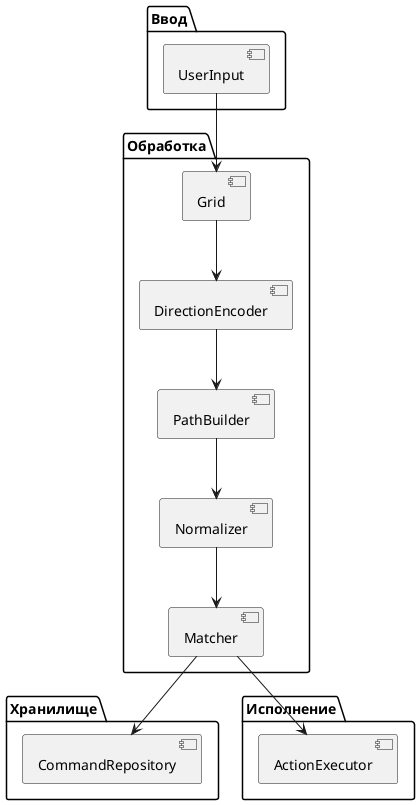
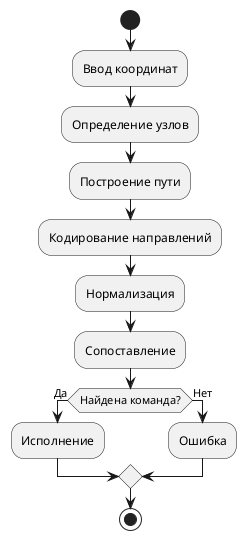
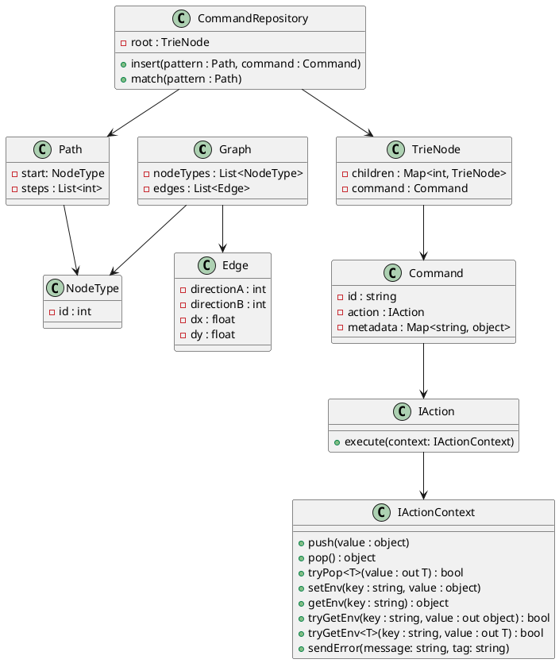

УДК 004.4 {.compact}

Руководитель проектной практики: М.В. Алпатова {.compact}

Измайлов А.Р. Отчёт по проектной практике по образовательной программе «Разработка и дизайн компьютерных игр и мультимедийных приложений» направления подготовки «Программная инженерия» на тему «Инструментальная библиотека распознавания и исполнения символьных команд в игровых механиках» / Руководитель: М.В. Алпатова: М. 2026 г., РТУ МИРЭА – __ стр., __ илл., __ табл., __ ист. лит., __ прил. {.compact}

Ключевые слова: графовые паттерны, символьные команды, интерактивные приложения, алгоритмы нормализации, универсальная библиотека, обработка пользовательского ввода. {.compact}

Целью работы является разработка программной библиотеки для распознавания и исполнения символьных команд, вводимых пользователем на графовых сетках произвольной геометрии и топологии, обеспечивающей преобразование координат ввода в последовательность направлений, нормализацию паттернов и их однозначное сопоставление с заданным набором команд. {.compact}

В ходе выполнения работы проведён анализ предметной области и существующих решений в области распознавания графических команд. Выявлены ограничения: привязка к фиксированной геометрии сетки, высокая чувствительность к ошибкам ввода и недостаточная универсальность. На основе анализа сформулированы требования к разрабатываемой библиотеке. {.compact}

Разработана архитектура программной библиотеки, основанная на абстрактной графовой модели сетки, разработаны алгоритмы преобразования координат ввода в последовательность направлений, нормализации паттернов и сопоставления их с командами. Обоснован выбор технологического стека. {.compact}

Результатом проектного этапа является комплект документации, достаточный для последующей реализации библиотеки в рамках выпускной квалификационной работы. {.compact}

Izmaylov A.R. Project practice report on the educational program "Development and Design of Computer Games and Multimedia Applications" in the field of Software Engineering on the topic "Tool Library for Recognizing and Executing Symbolic Commands in Game Mechanics". {.compact}

Keywords: graph patterns, symbolic commands, interactive applications, normalization algorithms, universal library, user input processing. {.compact}

The purpose of the work is to develop a software library for recognizing and executing symbolic commands input by users on graph grids of arbitrary geometry and topology, providing conversion of input coordinates into sequences of directions, pattern normalization, and unambiguous mapping to a predefined set of commands. {.compact}

During the work, an analysis of the subject area and existing solutions in graphical command recognition was carried out, and their limitations were identified: dependence on fixed grid geometry, high sensitivity to input errors, and lack of universality. Based on this analysis, requirements for the developed library were formulated. {.compact}

The library architecture was designed based on an abstract graph model of the grid, and algorithms for converting input coordinates into sequences of directions, pattern normalization, and mapping patterns to commands were developed. The choice of the technology stack was justified. {.compact}

The result of the design stage is a set of documentation sufficient for the subsequent implementation of the library within the final qualification work. {.compact}

РТУ МИРЭА: 119454, Москва, пр-т Вернадского, д. 78
кафедра игровой индустрии (ИИ)
Тираж: 1 экз. (на правах рукописи)
Файл: «090304_22И1656_ИзмайловАР.pdf», исполнитель Измайлов А.Р.
© А.Р.Измайлов {.compact}


[[toc]]

<div class="page-break">

# СПИСОК ИСПОЛЬЗУЕМЫХ СОКРАЩЕНИЙ

|        |                                                                           |
| ------ | ------------------------------------------------------------------------- |
| ПО     | Программное обеспечение                                                   |
| ГС     | Графическая сетка                                                         |
| СК     | Символьная команда                                                        |
| DLL    | Dynamic Link Library                                                      |
| R_norm | Нормализованный паттерн                                                   |
| P      | Последовательность направлений                                            |
| R      | Последовательность относительных поворотов                                |
| API    | Application Programming Interface (Интерфейс программирования приложений) |
| IDE    | Integrated Development Environment (Интегрированная среда разработки)     |

{.no-border .reset-text}


</div>


## ВВЕДЕНИЕ

Современные интерактивные системы, включая видеоигры и мультимедийные приложения, активно развиваются в направлении повышения естественности и интуитивности взаимодействия пользователя с цифровой средой. Наряду с традиционными способами управления, основанными на использовании кнопок и интерфейсных элементов, все более широкое распространение получают методы ввода, основанные на графических жестах и символьных паттернах.

В рамках данной работы используется понятие графических паттернов (символьных команд), которое отличается от классических жестов и требует отдельного рассмотрения.

В традиционных системах распознавания жестов (gesture recognition) пользовательский ввод интерпретируется как непрерывная траектория движения в пространстве.[6][7] В таких системах существенную роль играют форма траектории, скорость, динамика движения и временные характеристики.

В отличие от этого, в разрабатываемой системе пользовательский ввод рассматривается как дискретная последовательность переходов между узлами графовой сетки, что соответствует понятию графического символа.[11] Таким образом, ввод представляет собой не непрерывный жест, а структурированный паттерн, формируемый в дискретном пространстве.

Следовательно, рассматриваемая задача относится не столько к классическому распознаванию жестов, сколько к распознаванию символических паттернов в дискретных графовых структурах, что определяет выбор методов и подходов, используемых в работе.

Предметная область исследования включает системы распознавания пользовательского ввода, основанные на анализе пространственных траекторий и графических паттернов, формируемых пользователем на различных типах сеток.[6][7][11]

Анализ существующих решений показал, что подобные системы, несмотря на успешное применение, обладают рядом существенных ограничений: привязкой к фиксированной геометрии сетки, отсутствием универсальности и высокой чувствительностью к ошибкам пользовательского ввода. Это затрудняет их повторное использование и адаптацию в различных программных продуктах.[18][19][20]

Актуальность работы обусловлена необходимостью разработки универсального программного решения для распознавания графических команд, обеспечивающего устойчивость к вариативности ввода и независимость от геометрии используемой сетки. В условиях роста сложности интерактивных систем данная задача приобретает особую значимость.

Научная новизна работы заключается в применении абстрактной графовой модели для представления пользовательского ввода, а также в использовании относительного кодирования направлений и нормализации паттернов, обеспечивающих инвариантность к поворотам и направлению обхода.

Объект исследования — системы распознавания и исполнения пользовательских символов и графических паттернов в интерактивных приложениях.

Предмет исследования — методы и алгоритмы представления, нормализации и сопоставления графических команд на основе графовых структур.

Целью работы является разработка программной библиотеки для распознавания и исполнения символьных команд, вводимых пользователем на графовых сетках, обеспечивающей преобразование координат ввода в последовательность направлений, нормализацию паттернов и их однозначное сопоставление с заданным набором команд.

Для достижения поставленной цели необходимо решить следующие задачи:

1. Проанализировать существующие методы и системы распознавания графических команд.
2. Разработать модель представления сетки в виде графовой структуры.
3. Разработать алгоритм преобразования координат пользовательского ввода в последовательность направлений.
4. Разработать механизм относительного кодирования и нормализации паттернов.
5. Разработать алгоритмы сопоставления паттернов с командами.
6. Спроектировать программную библиотеку с модульной архитектурой.
7. Провести оценку корректности и эффективности предложенного решения.

Методы исследования, используемые в работе, включают:

* методы теории графов;
* алгоритмический анализ;
* методы структурного и объектно-ориентированного проектирования;
* методы анализа и сравнения существующих решений.

Практическая значимость работы заключается в создании универсальной программной библиотеки, которая может быть использована при разработке видеоигр, мультимедийных приложений и интерактивных систем, требующих распознавания графических команд.

Перспективы дальнейшего развития работы связаны с расширением механизмов распознавания, включая обработку неточных и шумовых данных, внедрение вероятностных методов сопоставления, а также интеграцию с современными игровыми и графическими движками.

Информационная база исследования включает:

* научную литературу по распознаванию образов и пользовательским интерфейсам;
* публикации и материалы по алгоритмам обработки графических символов;
* документацию языков программирования и платформ разработки;
* открытые источники и описания существующих систем графического ввода.

Данная работа состоит из двух основных разделов.

В исследовательском разделе рассматривается предметная область, проводится анализ существующих решений, выявляются их недостатки, формируются требования к разрабатываемой системе и ставится задача проектирования.

В проектном разделе разрабатывается архитектура программной библиотеки, описываются структура системы, используемые алгоритмы обработки данных, модель хранения и сопоставления паттернов, а также обосновываются принятые проектные решения.

Таким образом, структура работы обусловлена логикой перехода от анализа предметной области к разработке и обоснованию программного решения.

# ИССЛЕДОВАТЕЛЬСКИЙ РАЗДЕЛ {.numerated .hide-number}

## Обобщенная характеристика предметной области {.numerated}

Современные интерактивные системы и видеоигры активно используют разнообразные способы взаимодействия пользователя с цифровой средой.[3][4][5] Наряду с традиционными методами управления, основанными на использовании кнопок и интерфейсных элементов, всё более широкое распространение получают альтернативные подходы, основанные на использовании графических символов и символьных паттернов.[6][7]

В подобных системах пользователь формирует команды посредством пространственного движения, задавая определённую траекторию на рабочей поверхности или сетке. Такой подход позволяет повысить интуитивность взаимодействия, увеличить вовлеченность пользователя и расширить возможности управления системой.

Особое значение имеют системы, в которых ввод осуществляется на основе графовых сеток, представляющих собой структуры с явно заданными переходами между узлами. Использование различных типов замощений плоскости позволяет формировать уникальные ограничения и правила взаимодействия, что особенно актуально для видеоигровых механик.

В настоящее время подобные решения применяются преимущественно в рамках конкретных проектов и не обладают универсальностью.[18][19][20] Это создает необходимость разработки обобщенного подхода к распознаванию графических паттернов, независимого от конкретной реализации сетки и особенностей приложения.


## Характеристика объекта исследования {.numerated}

Объектом исследования является процесс распознавания и исполнения символьных команд в интерактивных мультимедиа-приложениях и видеоигровых системах, основанный на использовании графических паттернов.[6][7][18]

Данный процесс характеризуется следующими особенностями:
* формирование команд осуществляется через последовательность переходов между вершинами графовой сетки;
* используется разнообразие типов сеток, включая регулярные и произвольные замощения;
* требуется устойчивость к неточностям пользовательского ввода;
* возможна вариативность начала, направления и формы ввода;
* система должна обеспечивать модульность и возможность интеграции в различные программные среды.

Таким образом, объект исследования представляет собой сложный процесс взаимодействия пользователя с системой, включающий этапы регистрации ввода, интерпретации траектории и выполнения соответствующих действий.


## Характеристика предмета исследования {.numerated}

Предметом исследования являются методы и алгоритмы представления, кодирования и распознавания символьных команд на основе графовых структур.

К основным аспектам предмета исследования относятся:
* использование локальных индексов направлений для описания переходов между узлами;
* нормализация последовательностей направлений для обеспечения устойчивого распознавания;
* поддержка различных типов замощений и графовых структур;
* учет симметрии и обратного направления ввода;
* разработка механизмов сопоставления паттернов с действиями.

Предмет исследования охватывает как математические модели, так и алгоритмические решения, лежащие в основе системы распознавания графических команд.


## Анализ существующих решений и аналогов {.numerated}

Существующие решения демонстрируют разнообразные подходы к реализации механик графического ввода, однако большинство из них разрабатываются под конкретные задачи и имеют ограниченную применимость.

Title: Анализ существующих решений и аналогов

| Критерий                     | Hexcasting (Minecraft мод)[18] | Система заклинаний в Okami[19] | Система символов в Arx Fatalis[20] | Разрабатываемое решение              |
| ---------------------------- | ------------------------------ | ------------------------------ | ---------------------------------- | ------------------------------------ |
| Платформа                    | ПК                             | Консоли, ПК                    | ПК                                 | Кроссплатформенная (.NET)            |
| Тип сетки / топологии        | Дискретная (треугольная)       | Непрерывное пространство       | Непрерывное пространство           | Дискретная (произвольный граф)       |
| Способ кодирования           | Абсолютные переходы            | Геометрические жесты           | Геометрические жесты               | Относительные направления (повороты) |
| Нормализация                 | Ограниченная                   | Отсутствует                    | Отсутствует                        | Полная (инвариантность к повороту)   |
| Устойчивость к ошибкам ввода | Средняя                        | Низкая                         | Низкая                             | Повышенная                           |
| Поддержка обратного ввода    | Частичная                      | Отсутствует                    | Отсутствует                        | Полная                               |
| Расширяемость команд         | Ограниченная                   | Ограниченная                   | Ограниченная                       | Высокая                              |
| Сложность интеграции         | Высокая (моддинг)              | Высокая                        | Высокая                            | Низкая (библиотека/API)              |
| Наличие API / SDK            | Ограниченное                   | Отсутствует                    | Отсутствует                        | Предусмотрено                        |
| Производительность           | Высокая                        | Средняя                        | Средняя                            | Высокая                              |
| Универсальность              | Низкая                         | Низкая                         | Низкая                             | Высокая                              |

{.break-words}

Проведенный анализ показывает, что существующие решения:

* ориентированы на фиксированную геометрию или непрерывное пространство, что ограничивает их переносимость;
* не обеспечивают универсального механизма кодирования и нормализации паттернов;
* обладают высокой чувствительностью к ошибкам пользовательского ввода;
* не поддерживают обратный ввод и инвариантность к преобразованиям;
* имеют ограниченные возможности расширения и интеграции в сторонние системы.

В отличие от них, разрабатываемое решение обеспечивает универсальный подход к распознаванию графических команд за счет использования графовой модели, относительного кодирования направлений и нормализации паттернов[6][7], что повышает устойчивость, расширяемость и переносимость системы.


## Выявление проблем, ограничений и недостатков существующих решений {.numerated}

На основе проведенного анализа можно выделить следующие ключевые проблемы:
* ограниченность используемых сеток — большинство решений поддерживают только один тип геометрии;
* отсутствие универсальности — системы разрабатываются под конкретный продукт и не переиспользуются;
* чувствительность к ошибкам ввода — даже незначительные отклонения могут приводить к неверному распознаванию;
* отсутствие нормализации паттернов — одинаковые по смыслу команды могут распознаваться как разные;
* сложность масштабирования — добавление новых паттернов требует переработки системы;
* низкая гибкость настройки — ограниченные возможности адаптации под различные сценарии использования.

Выявленные недостатки подтверждают необходимость разработки универсального решения, способного устранить указанные ограничения.


## Формирование требований к разрабатываемому решению {.numerated}

На основе выявленных проблем формируются следующие требования к разрабатываемой библиотеке:

### Функциональные требования:
* поддержка ввода графических паттернов на сетках произвольной структуры;
* преобразование координат пользовательского ввода в последовательности направлений;
* нормализация паттернов независимо от ориентации и точки начала;
* сопоставление паттернов с командами;
* поддержка симметрии и обратного ввода.

### Нефункциональные требования:
* модульность и возможность интеграции в различные системы;
* расширяемость и поддержка добавления новых паттернов;
* устойчивость к ошибкам пользовательского ввода;
* производительность, достаточная для использования в реальном времени;
* независимость от конкретного типа сетки.


## Постановка задачи на проектирование {.numerated}

Целью проектирования является разработка универсальной программной библиотеки для распознавания и исполнения символьных команд, вводимых пользователем в виде графических паттернов.

Для достижения цели необходимо решить следующие задачи:
1. Разработать модель представления сетки в виде графовой структуры.
2. Реализовать алгоритм преобразования координат ввода в последовательность направлений.
3. Разработать механизм нормализации паттернов.
4. Реализовать алгоритмы сопоставления паттернов с командами.
5. Обеспечить модульную архитектуру библиотеки.
6. Провести тестирование корректности распознавания.

Гипотеза исследования: применение графовых сеток для распознавания символьных команд обеспечивает однозначное определение действий без коллизий, с высокой воспроизводимостью ввода, а использование произвольных замощений расширяет возможности интерактивных механик и повышает вариативность пользовательских действий.


# ПРОЕКТНЫЙ РАЗДЕЛ {.numerated .hide-number}

## Разработка структурной схемы разрабатываемого решения {.numerated}

Разрабатываемое решение представляет собой программную библиотеку, предназначенную для распознавания и исполнения графических команд, вводимых пользователем на сетках произвольной структуры.

Система реализует полный цикл обработки пользовательского ввода: от регистрации координат до вызова соответствующего действия. В рамках данного цикла выполняется преобразование координат в последовательность направлений, нормализация полученного паттерна, его сопоставление с набором зарегистрированных команд и последующее исполнение связанного действия.

Ключевой особенностью решения является использование абстрактной графовой модели, описывающей переходы между узлами без жесткой привязки к геометрическим координатам.



### Описание подсистем

* Grid — интерпретация координат ввода и определение узлов графа, включая поиск ближайшего узла с учетом допуска по расстоянию
* DirectionEncoder — преобразование переходов между узлами в дискретные направления
* PathBuilder — формирование последовательности переходов пользователя с фильтрацией шумовых переходов
* Normalizer — приведение паттерна к каноническому виду и устранение вариативности ввода
* Matcher — сопоставление нормализованного паттерна с зарегистрированными командами с учетом допустимых отклонений
* CommandRepository — хранение команд в виде структуры (trie), поддерживающей префиксное сопоставление
* ActionExecutor — выполнение действия, связанного с распознанной командой, и генерация события для внешней системы

## Разработка функциональной спецификации {.numerated}

### Основные функции системы

Title: Основные функции системы

| Функция           | Описание                                  |
| ----------------- | ----------------------------------------- |
| Регистрация ввода | Получение координат пользователя          |
| Построение пути   | Формирование последовательности переходов |
| Кодирование       | Преобразование в индексы направлений      |
| Нормализация      | Приведение к каноническому виду           |
| Сопоставление     | Поиск команды                             |
| Исполнение        | Выполнение действия                       |


### Входные данные

* координаты указателя пользователя
* описание графа сетки
* база команд

### Выходные данные

* распознанная команда
* событие выполнения действия
* визуальная обратная связь


### Исключительные ситуации

* разрыв пути
* переход вне допустимых узлов
* отсутствие совпадения
* неоднозначное сопоставление

### Интерфейс взаимодействия с системой

Система предоставляет программный интерфейс, включающий следующие основные операции:

* регистрация команды: RegisterCommand(pattern, action)
* обработка пользовательского ввода: ProcessInput(points)
* получение результата распознавания: GetResult()
* выполнение команды: Execute(command)

### Политика обработки ошибок

В системе предусмотрены следующие категории ошибок:

* ошибки ввода (разрыв траектории, выход за пределы сетки);
* ошибки сопоставления (отсутствие команды);
* ошибки исполнения (исключение в пользовательском действии).

Обработка ошибок включает:
* логирование;
* возврат статуса выполнения;
* возможность игнорирования (fallback) без прерывания работы системы.

### Обеспечение устойчивости к ошибкам ввода

Одним из ключевых требований к системе является устойчивость к неточностям пользовательского ввода. В рамках разработки предложен набор правил и методов, позволяющих повысить корректность распознавания.

#### 1. Дискретизация пользовательского ввода

Поскольку система основана на графовой модели сетки, обработка пользовательского ввода осуществляется в дискретном пространстве узлов.

Вместо работы с непрерывными координатами применяется отображение входных точек в вершины графа:

* каждая входная точка сопоставляется ближайшему узлу графа;
* последовательности точек, попадающих в один и тот же узел, агрегируются в одно состояние;
* переход между узлами фиксируется только при изменении текущей вершины.

Таким образом, устраняется влияние дрожания ввода и высокой частоты дискретизации устройства, поскольку система работает с последовательностью узлов, а не сырых координат.

Дополнительно вводятся ограничения:

* минимальная длина перехода (исключение повторных посещений одного узла);
* игнорирование кратковременных возвратов (например, A → B → A);
* фиксация только валидных переходов, существующих в графе.

#### 2. Привязка к узлам графа с допуском

При сопоставлении координат узлам графа используется правило ближайшего узла:

$$
t_i = \arg\min_{t \in T} dist(p_i, t)
$$

с дополнительным ограничением:

$$
dist(p_i, t_i) \leq \delta
$$

где δ — допустимое отклонение.

Если расстояние превышает порог, точка игнорируется.

#### 3. Поддержка вариативности ввода

Система учитывает возможные вариации:

* различную длину паттернов (сокращенные или расширенные версии);
* симметрии разных типов.


Таким образом, устойчивость достигается за счет комбинации пространственной фильтрации, нормализации траектории и допусков при сопоставлении, что позволяет корректно обрабатывать неточный пользовательский ввод без существенного увеличения вычислительной сложности.

## Проектирование подсистемы исполнения команд {.numerated}

Подсистема исполнения отвечает за преобразование распознанной команды в конкретное действие, выполняемое во внешней системе.

### Модель команды

Команда представляется структурой:

* id — уникальный идентификатор
* pattern — нормализованный паттерн
* action — исполняемое действие
* metadata — дополнительные параметры

### Интерфейс действия

Для обеспечения расширяемости используется абстрактный интерфейс:

interface IAction {
    void Execute(ActionContext context);
}

### Контекст выполнения

Контекст содержит данные, необходимые для выполнения действия:

* целевой объект
* позиция выполнения
* параметры окружения
* контекст выполнения команды

### Механизм вызова

После успешного сопоставления выполняется следующая последовательность:

Matcher → Command → ActionExecutor → IAction.Execute()

### Интеграция в систему

Подсистема исполнения может быть интегрирована:

* через событийную модель
* через игровой цикл (Update)
* через API движка

### Пример сценария использования в игровой механике

Рассмотрим пример использования системы в контексте игровой механики заклинаний.

1. Пользователь вводит паттерн на графовой сетке (например, последовательность поворотов: [1, -1, 2]).
2. После нормализации формируется паттерн R_norm.
3. Matcher находит соответствующую команду, например:
   Command.id = "Fireball"
4. CommandRepository возвращает связанную команду.
5. ActionExecutor вызывает связанное действие:
   IAction.Execute(context)

Пример содержимого ActionContext:

* target — выбранный игровой объект (враг)
* position — позиция применения способности
* mana — текущий уровень ресурса игрока
* cooldowns — состояние перезарядок

### Обработка ограничений игровой логики

Перед выполнением действия могут выполняться проверки:

* достаточность ресурса (mana >= cost)
* отсутствие активного кулдауна
* допустимость состояния (например, игрок не оглушен)

Возможные сценарии:

* успех — действие выполняется (нанесение урона, создание эффекта)
* недостаток ресурса — генерация события ошибки
* активный кулдаун — отказ в выполнении
* конфликт состояния — отмена действия

## Разработка схемы функционирования системы {.numerated}

Процесс работы системы можно представить следующим образом:



### Описание процесса

1. координаты преобразуются в узлы графа
2. строится путь
3. переходы кодируются
4. паттерн нормализуется
5. выполняется поиск совпадения
6. вызывается действие


## Проектирование структуры данных и объектов {.numerated}

Система использует оперативное (in-memory) хранение данных, что обеспечивает высокую скорость доступа и минимальные накладные расходы при обработке пользовательского ввода в реальном времени.

### Основные сущности:

* Graph
* NodeType
* Edge
* Path
* Command
* CommandRepository
* TrieNode
* IAction
* IActionContext



### Описание модели

Разработанная модель данных основана на представлении сетки в виде графовой структуры и включает следующие ключевые элементы:

* граф (Graph) определяет топологию сетки и допустимые переходы между узлами;
* типы узлов (NodeType) задают возможные варианты локальной структуры переходов;
* ребра (Edge) описывают допустимые направления перемещения и их геометрические характеристики;

* путь (Path) представляет собой результат обработки пользовательского ввода и включает начальный узел (start), а также последовательность переходов (steps), закодированных в виде индексов направлений;

* команда (Command) описывает символьную команду, включая уникальный идентификатор, нормализованный паттерн, исполняемое действие и метаданные;

* интерфейс действия (IAction) определяет контракт выполнения игровой логики, связанной с командой;

* контекст выполнения (IActionContext) представляет собой универсальную среду передачи данных между системой распознавания и игровой логикой и включает:
  - стековую модель передачи параметров (push/pop);
  - доступ к окружению выполнения (env);
  - механизм обработки ошибок (sendError);

* хранилище команд (CommandRepository) реализует операции добавления и поиска команд и инкапсулирует структуру хранения;

* узел префиксного дерева (TrieNode) представляет элемент структуры хранения, содержащий переходы к дочерним узлам и ссылку на команду в случае совпадения паттерна.

Данная модель обеспечивает абстрагирование от конкретной геометрии сетки, разделение ответственности между обработкой ввода и исполнением логики, а также поддержку расширяемых сценариев использования в игровых механиках.

### Организация хранения данных

Хранение команд является ключевым элементом системы, определяющим эффективность и гибкость сопоставления паттернов.

Рассмотрены два основных подхода к организации хранилища.

#### 1. Хеш-таблица (Dictionary)

Команды могут храниться в виде отображения:

Dictionary<R_norm, Command>

где нормализованный паттерн используется в качестве ключа.

Преимущества подхода:

* простота реализации;
* быстрый доступ к команде (O(1) в среднем);
* эффективность при использовании фиксированного набора паттернов.

Недостатки:

* необходимость вычисления хеша последовательности (O(n));
* отсутствие поддержки частичных и префиксных совпадений;
* ограниченные возможности расширения логики сопоставления;
* неявное представление взаимосвязей между паттернами.

#### 2. Префиксное дерево (Trie)

Альтернативным подходом является использование префиксного дерева, в котором каждый уровень соответствует элементу последовательности поворотов.

Каждый путь от корня к узлу дерева соответствует последовательности переходов, представленной структурой Path, при этом конечные узлы содержат ссылки на соответствующие команды.

Преимущества подхода:

* линейная сложность сопоставления O(n);
* отсутствие необходимости вычисления хеша;
* поддержка пошагового и частичного распознавания;
* возможность представления семейств паттернов (нескольких вариантов одной команды);
* эффективное использование общих префиксов последовательностей.

Недостатки:

* более высокая сложность реализации;
* увеличение потребления памяти по сравнению с хеш-таблицей.

#### Выбор подхода

В рамках данной работы выбран подход на основе префиксного дерева (trie), так как он обеспечивает:

* линейную сложность сопоставления O(n), сопоставимую с использованием хеш-таблицы;
* более высокую гибкость при работе с паттернами;
* поддержку расширенных сценариев обработки (частичное распознавание, вариативность ввода);
* естественное представление структуры и взаимосвязей между паттернами.

Таким образом, использование префиксного дерева позволяет повысить выразительность и расширяемость системы без ухудшения асимптотической производительности.

В модели данных хранилище команд представлено в виде префиксного дерева (trie), реализованного через структуру TrieNode и обертку CommandRepository. Это обеспечивает явное соответствие между теоретическим выбором структуры хранения и её программной моделью.

## Выбор и описание алгоритмов обработки данных и управления {.numerated}

В рамках разрабатываемой библиотеки реализуется последовательность алгоритмов, обеспечивающих преобразование пользовательского ввода в исполняемую команду.

Обработка данных включает следующие этапы:

1. интерпретация координат ввода
2. построение пути по графу
3. кодирование направлений
4. преобразование в относительные повороты
5. нормализация паттерна
6. сопоставление с базой команд

### Алгоритм интерпретации координат {.numerated}

На вход системы поступает последовательность координат:

$I = (p_1, p_2, ..., p_n), \quad p_i \in \mathbb{R}^2$ {.equation}

Каждая точка сопоставляется ближайшему узлу графа:

$p_i \rightarrow t_i \in T$ {.equation}

Результатом является последовательность узлов:

$N = (t_1, t_2, ..., t_n)$ {.equation}

### Алгоритм построения пути {.numerated}

Путь формируется как последовательность переходов между узлами:

$P = (d_1, d_2, ..., d_{n-1})$ {.equation}

где каждый переход определяется функцией:

$d_i = \delta(t_i, t_{i+1})$ {.equation}

### Алгоритм относительного кодирования направлений {.numerated}

Для устранения зависимости от глобальной ориентации используется относительное кодирование в кольце направлений.

Пусть:

$P = (d_1, d_2, ..., d_k)$ {.equation}

последовательность переходов между узлами графа.

Тогда строится последовательность относительных поворотов:

$R = (r_2, r_3, ..., r_k)$ {.equation}

где каждый поворот определяется функцией:

$r_i = \Delta(d_{i-1}, d_i)$ {.equation}

#### Интерпретация функции (\Delta)

* Нулевой поворот ( r_i = 0 ) соответствует движению прямо по ребру, из которого мы пришли.
* Положительное значение ( r_i = n > 0 ) — поворот вправо на n граней относительно предыдущего направления.
* Отрицательное значение ( r_i = -n < 0 ) — поворот влево на n граней относительно предыдущего направления.

Ключевая особенность: нулевой элемент кольца поворотов всегда соответствует ребру, из которого пришли, а все остальные направления вычисляются относительно него. Это позволяет:
1. Однозначно кодировать траекторию в локальном контексте узла.
2. Обеспечить инвариантность к повороту всей траектории.
3. Исключить необходимость дополнительной нормализации глобального угла.

### Алгоритм нормализации паттерна {.numerated}

После перехода к относительным поворотам остаётся устранить неоднозначность, связанную с направлением обхода (реверсом).

Для последовательности:

$R = (r_2, r_3, ..., r_k)$ {.equation}

рассматривается обратный вариант:

$R_{rev} = (-r_k, -r_{k-1}, ..., -r_2)$ {.equation}

Инверсия знаков обусловлена тем, что при реверсе левый и правый повороты меняются местами.

Нормализованный паттерн определяется как:

$R_{norm} = \min(R, R_{rev})$ {.equation}

где используется лексикографическое сравнение.


### Алгоритм сопоставления паттернов {.numerated}

Каждая команда задаётся нормализованным паттерном:

$C: R_{norm} \rightarrow A$ {.equation}

Алгоритм сопоставления:

```
1. Получить R_norm
2. Выполнить поиск в CommandRepository
3. Если найдено:
    вернуть команду
4. Иначе:
    вернуть null
```


### Свойство однозначности сопоставления {.numerated}

#### Условие

Пусть задано множество команд:

$\mathcal{C} = {C_1, C_2, ..., C_m}$ {.equation}

и выполняется условие уникальности:

$\forall i \neq j: \quad R_i^{norm} \neq R_j^{norm}$ {.equation}


#### Свойства преобразований

Преобразование пользовательского ввода можно представить как композицию функций:

$I \rightarrow N \rightarrow P \rightarrow R \rightarrow R_{norm}$ {.equation}

Каждый этап обладает следующими свойствами:
* детерминированность
* однозначность результата
* отсутствие случайных факторов

Следовательно:

$\forall I \in \mathcal{I}_{valid}: \exists! \ R_{norm}(I)$ {.equation}

*Примечание: $\mathcal{I}_{valid}$ — множество корректных вводов (без разрывов и ошибок, выходящих за пределы узлов графа).*

#### Условие отсутствия коллизий

Если нормализованные паттерны команд различны, то каждому входу соответствует не более одной команды.

#### Обоснование

Если два различных входа приводят к одинаковому нормализованному паттерну, то они считаются эквивалентными с точки зрения системы распознавания.

При условии уникальности паттернов в базе команд каждому нормализованному паттерну соответствует не более одной команды, что исключает неоднозначность сопоставления.

#### Практическое ограничение

Для обеспечения данного свойства необходимо:
* выполнять проверку уникальности паттернов при добавлении команд
* использовать нормализованное представление как ключ хранения


### Оценка вычислительной сложности {.numerated}

Title: Оценка вычислительной сложности

| Этап                     | Сложность |
| ------------------------ | --------- |
| Преобразование координат | O(n)      |
| Построение пути          | O(n)      |
| Кодирование поворотов    | O(n)      |
| Нормализация             | O(n)      |
| Сопоставление            | O(n)      |

где:

* n — длина пути
* m — количество команд

Дополнительная память требуется только для хранения паттернов команд и временных массивов длиной n.

## Выбор комплекса технических средств и архитектуры {.numerated}

### Архитектура

Система реализуется в виде модульной программной библиотеки, построенной на основе набора слабо связанных компонентов, каждый из которых отвечает за отдельный этап обработки пользовательского ввода.

Архитектура ориентирована на использование в составе внешних систем (игровых движков, интерактивных приложений) и не содержит зависимостей от пользовательского интерфейса, что обеспечивает ее универсальность.

Ключевые особенности архитектуры:

* разделение ответственности между компонентами (обработка ввода, кодирование, нормализация, сопоставление, исполнение);
* возможность независимой замены и расширения отдельных модулей;
* поддержка интеграции через программный интерфейс (API);
* независимость от конкретной реализации сетки и среды выполнения;
* ориентированность на встраивание в игровой цикл или событийную модель приложения.

Преимущества выбранного подхода:

* масштабируемость за счет расширения набора компонентов и алгоритмов;
* переиспользование библиотеки в различных типах приложений;
* гибкость интеграции без привязки к UI и конкретному фреймворку;
* упрощение тестирования отдельных компонентов системы.

### Системные требования

Title: Системные требования

| Параметр             | Требование                                                |
| -------------------- | --------------------------------------------------------- |
| Операционная система | Windows, Linux (кроссплатформенная среда выполнения .NET) |
| Процессор            | 1 ядра и выше                                             |
| Оперативная память   | от 1 ГБ                                                   |
| Платформа            | .NET 8 и выше                                             |
| Тип приложения       | поддержка встраивания в игровые и интерактивные системы   |

Системные требования определяются тем, что разрабатываемое решение представляет собой библиотеку, не выполняющую ресурсоемких вычислений и не предъявляющую высоких требований к аппаратному обеспечению.

Основная нагрузка связана с обработкой пользовательского ввода в реальном времени, что требует обеспечения линейной сложности алгоритмов и минимальных задержек при выполнении.

Библиотека может использоваться как в настольных приложениях, так и в составе игровых движков, при этом требования к ресурсам определяются в первую очередь окружением, в которое она интегрируется.

### Производительность

* сложность обработки: O(n)
* сложность сопоставления: O(n)
* где n — длина пути

## Выбор и обоснование программных средств {.numerated}

### Используемые технологии

Title: Используемые технологии

| Технология | Обоснование                                                                                 |
| ---------- | ------------------------------------------------------------------------------------------- |
| C#         | интеграция с игровыми движками (Unity, Mono), поддержка событийной модели и удобный interop |
| .NET       | поставка библиотеки в виде DLL и NuGet-пакета, кроссплатформенная сборка и выполнение       |

Выбор технологического стека обусловлен требованиями к разрабатываемой библиотеке как к переиспользуемому программному компоненту[1][2][3].

Использование платформы .NET позволяет реализовать библиотеку в виде изолированного модуля, поставляемого в формате DLL или распространяемого через пакетный менеджер NuGet. Это обеспечивает удобство интеграции в сторонние проекты, включая игровые приложения и интерактивные системы.

Язык C#[2] обеспечивает:
* совместимость с популярными игровыми движками (в первую очередь Unity[3]);
* поддержку объектно-ориентированного и компонентного подхода;
* удобную реализацию событийной модели взаимодействия (callbacks, delegates, events);
* возможность взаимодействия с нативным кодом (interop) при необходимости.

Платформа .NET[1] дополнительно предоставляет:
* средства кроссплатформенной сборки и выполнения (Windows, Linux);
* встроенные механизмы unit-тестирования и интеграции с CI/CD;
* эффективное управление памятью и достаточную производительность для задач реального времени;
* поддержку модульной архитектуры и повторного использования компонентов.

Таким образом, выбранный стек технологий обеспечивает баланс между производительностью, удобством интеграции и расширяемостью системы.

Средства разработки (IDE, системы контроля версий, системы сборки и CI/CD) используются на этапе реализации и не входят в состав архитектуры программного продукта, однако обеспечивают качество разработки, тестирования и сопровождения библиотеки.

# ЗАКЛЮЧЕНИЕ

В ходе выполнения работы была решена задача разработки универсальной программной библиотеки для распознавания и исполнения символьных команд, вводимых пользователем в виде графических паттернов на сетках произвольной структуры.

В исследовательском разделе был проведен анализ предметной области, рассмотрены существующие решения и выявлены их ключевые недостатки, включая ограниченность используемых геометрий, отсутствие универсальности и высокую чувствительность к ошибкам пользовательского ввода. На основе проведенного анализа были сформулированы функциональные и нефункциональные требования к разрабатываемому решению.

В проектном разделе разработана архитектура библиотеки, основанная на использовании абстрактной графовой модели, позволяющей описывать произвольные структуры сеток. Определены и формализованы основные этапы обработки данных: интерпретация координат, построение пути, кодирование направлений, нормализация паттернов и их сопоставление с командами.

В работе предложен подход к представлению пользовательского ввода на основе относительного кодирования направлений, обеспечивающий инвариантность к поворотам и направлению обхода, а также разработан механизм нормализации паттернов, исключающий неоднозначность распознавания. Обоснован выбор структуры хранения данных на основе префиксного дерева (trie), позволяющего обеспечить линейную сложность сопоставления и расширяемость системы.

Таким образом, поставленная цель работы достигнута: разработана архитектура и алгоритмическое обеспечение универсальной библиотеки для распознавания и исполнения графических команд. Предложенное решение обеспечивает однозначное сопоставление паттернов, устойчивость к вариативности пользовательского ввода и независимость от геометрии сетки.

Практическая значимость работы заключается в возможности использования разработанной библиотеки при создании видеоигр, мультимедийных приложений и интерактивных систем, требующих реализации механик графического ввода команд.

Дальнейшее развитие работы связано с переходом к этапу практической реализации и оформлением результатов в рамках технологического и экономического разделов ВКР.

В рамках технологического раздела планируется поэтапная разработка и реализация системы:

1. Реализация ядра библиотеки:
   * разработка модели графа и структуры сетки (Graph, NodeType, Edge);
   * реализация модуля интерпретации пользовательского ввода (Grid, Input processing);
   * разработка модуля построения пути (PathBuilder).

2. Реализация алгоритмов обработки:
   * реализация кодирования направлений (DirectionEncoder);
   * разработка механизма относительного кодирования поворотов;
   * реализация нормализации паттернов (Normalizer).

3. Реализация подсистемы сопоставления и хранения:
   * разработка структуры хранения команд на основе префиксного дерева (Trie);
   * реализация алгоритма сопоставления паттернов (Matcher);
   * поддержка расширяемых наборов команд и семейств паттернов.

4. Реализация подсистемы исполнения:
   * разработка интерфейса действий (IAction);
   * реализация модуля исполнения команд (ActionExecutor);
   * интеграция с внешней системой (игровой цикл или событийная модель).

5. Интеграция и разработка демонстрационного приложения:
   * создание прототипа (например, на базе игрового движка Unity или мультимедийного приложения);
   * реализация пользовательского ввода и визуальной обратной связи;
   * демонстрация работы системы на различных типах сеток.

6. Тестирование и валидация:
   * проведение модульного тестирования отдельных компонентов;
   * проверка корректности распознавания паттернов;
   * оценка устойчивости к ошибкам пользовательского ввода;
   * анализ производительности системы.

7. Подготовка пользовательского взаимодействия:
   * описание сценариев использования системы;
   * разработка API для интеграции;
   * подготовка документации для разработчиков.


Реализация указанных этапов позволит перейти от концептуальной модели к полнофункциональному программному продукту, готовому к практическому применению.


# СПИСОК ИСПОЛЬЗОВАННЫХ ИСТОЧНИКОВ

1. Microsoft. .NET Documentation / Microsoft. URL: [https://learn.microsoft.com/dotnet](https://learn.microsoft.com/dotnet)
2. Microsoft. C# Programming Guide / Microsoft. URL: [https://learn.microsoft.com/dotnet/csharp](https://learn.microsoft.com/dotnet/csharp)
3. Unity Technologies. Unity Manual / Unity. URL: [https://docs.unity3d.com](https://docs.unity3d.com)
4. Unity Technologies. Input System / Unity. URL: [https://docs.unity3d.com/Packages/com.unity.inputsystem](https://docs.unity3d.com/Packages/com.unity.inputsystem)
5. Epic Games. Unreal Engine Documentation / Epic Games. URL: [https://docs.unrealengine.com](https://docs.unrealengine.com)
6. Anthony L., Wobbrock J.O. $1 Unistroke Recognizer Extensions / L. Anthony // CHI. – 2020.
7. Vatavu R.-D. Improving Gesture Recognition Accuracy / R.-D. Vatavu // ACM Computing Surveys. – 2021.
8.  Cormen T., Leiserson C., Rivest R., Stein C. Introduction to Algorithms / T. Cormen. – MIT Press, 2022.
9.  Sedgewick R., Wayne K. Algorithms / R. Sedgewick. – Addison-Wesley, 2022.
10. Skiena S. The Algorithm Design Manual / S. Skiena. – Springer, 1998.
11. Diestel R. Graph Theory / R. Diestel. – Springer, 2017.
12. Goodrich M., Tamassia R. Data Structures and Algorithms / M. Goodrich. – Wiley, 2020.
13. Norman D. The Design of Everyday Things / D. Norman. – 2013.
14. Shneiderman B. Designing the User Interface / B. Shneiderman. – Pearson, 2018.
15. Schell J. The Art of Game Design / J. Schell. – CRC Press, 2019.
16. Fullerton T. Game Design Workshop / T. Fullerton. – CRC Press, 2020.
17. Unity Technologies. Game Architecture Guide / Unity. URL: [https://learn.unity.com](https://learn.unity.com)
18. CurseForge. Hexcasting Mod / CurseForge. URL: [https://www.curseforge.com/minecraft/mc-mods/hexcasting](https://www.curseforge.com/minecraft/mc-mods/hexcasting)
19. Nintendo. Okami Game Guide / Nintendo. – 2006.
20. Arkane Studios. Arx Fatalis Manual / Arkane Studios. – 2002.
